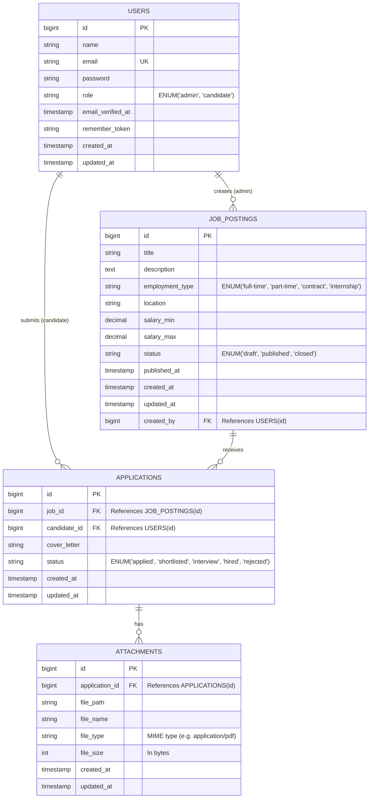

# Entity Relationship Diagram (ERD)

This diagram outlines the database schema for the ADITECH Recruitment System, focusing on the MVP requirements.

## Entity Descriptions

### 1. USERS
Stores authentication details for both system Administrators and Candidates.
- **role**: Differentiates between HR staff (`admin`) and applicants (`candidate`).
- **email**: Unique identifier for login.

### 2. JOB_POSTINGS
Represents job postings created by HR.
- **status**: Controls visibility (`draft` = hidden, `published` = visible on portal).
- **created_by**: Tracks which admin created the posting.
- **Note**: Named `job_postings` to avoid conflict with Laravel's queue `jobs` table.

### 3. APPLICATIONS
Links a specific Candidate (`USERS`) to a specific Job (`JOB_POSTINGS`).
- **status**: Tracks the workflow state (`applied` -> `shortlisted` -> `interview` -> `hired`/`rejected`).
- **cover_letter**: Optional text submission from the candidate.

### 4. ATTACHMENTS
Stores file metadata for uploaded CVs/Resumes associated with an application.
- **application_id**: Links the file to the specific application record.
- **file_path**: Relative path to the stored file in `storage/app/public`.
