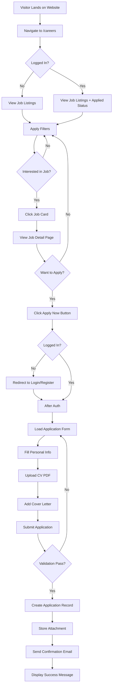
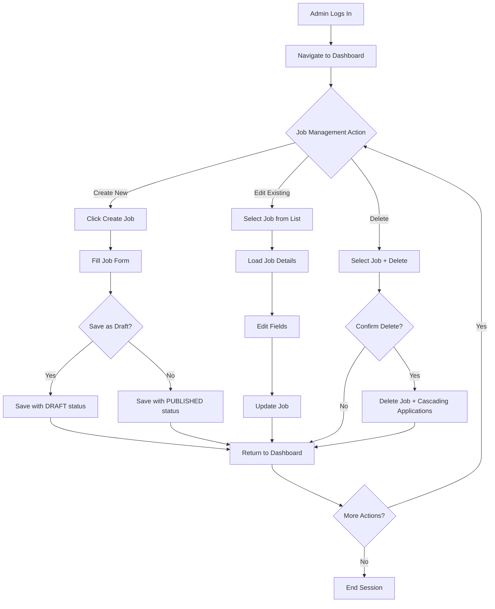
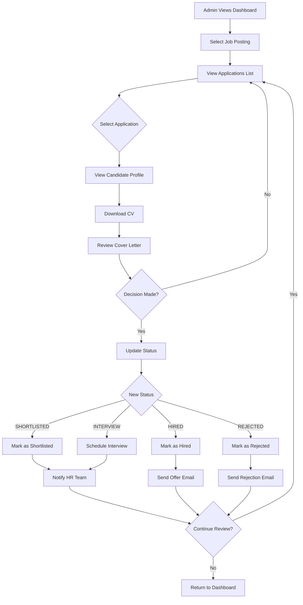
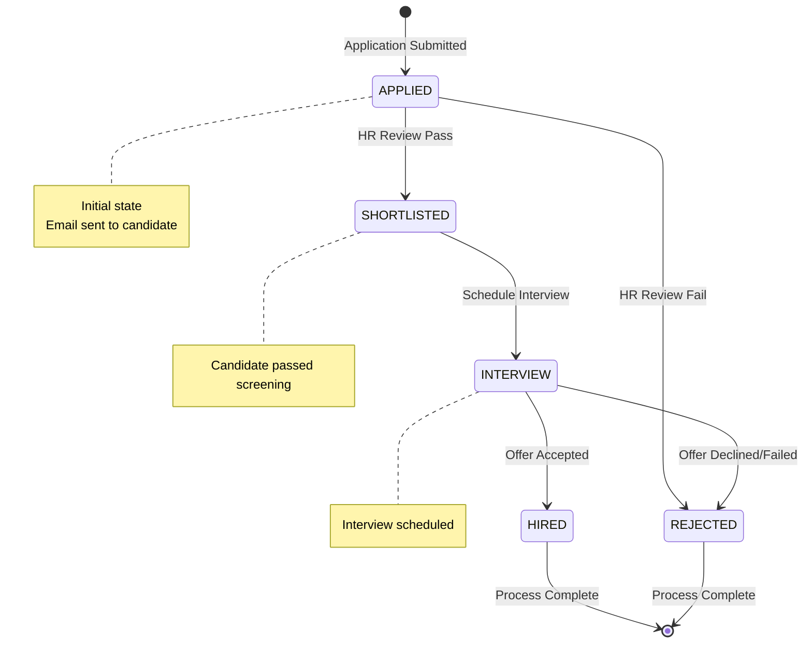
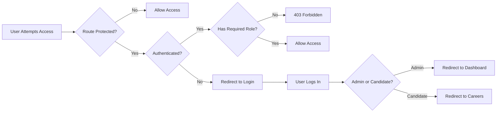

# ADITECH Recruitment System - System Flow

This document outlines the complete system flow for the ADITECH Recruitment System, describing the interactions between different user roles, data models, and application states.

---

## 1. System Overview

The recruitment system is built around two primary user roles:
- **Candidate**: External users who browse and apply for jobs
- **Admin/HR**: Internal users who manage job postings and review applications

---

## 2. Candidate Flow

### 2.1 Public Job Discovery Flow



### 2.2 Application Submission Process

1. **Form Validation**: System validates:
   - CV file type (PDF only)
   - CV file size (≤ 2MB)
   - Required fields completeness

2. **Data Storage**:
   - Create `APPLICATIONS` record with status `APPLIED`
   - Store CV file in `public/cvs/` directory
   - Create `ATTACHMENTS` record with file metadata

3. **Notification**:
   - On-screen success message
   - Automated email sent to candidate's email address

---

## 3. HR/Admin Flow

### 3.1 Job Management Flow



### 3.2 Application Review Flow



### 3.3 Application Status State Machine



---

## 4. Data Flow

### 4.1 Job Posting Lifecycle

```
┌─────────────────────────────────────────────────────────────┐
│                    JOB LIFECYCLE                             │
├─────────────────────────────────────────────────────────────┤
│                                                             │
│  [DRAFT] ────> [PUBLISHED] ────> [CLOSED]                   │
│     │               │                                        │
│     │               │                                        │
│     └───> [DELETED] │                                        │
│                     │                                        │
│                     └───> [DELETED]                         │
│                                                             │
└─────────────────────────────────────────────────────────────┘
```

**State Transitions**:
- **DRAFT**: Only visible to admins, can be edited
- **PUBLISHED**: Visible to all candidates on `/careers`, applications can be submitted
- **CLOSED**: No longer accepting applications, visible but cannot apply
- **DELETED**: Permanently removed from database (cascades delete applications)

### 4.2 Application Data Model Flow

```
User (Candidate)          Job Posting
     │                        │
     └───────────┬────────────┘
                 │
                 ▼
          Application
                 │
                 ▼
          Attachments (CV)
```

**Relationships**:
- `User` has many `Applications`
- `Job` has many `Applications`
- `Application` has many `Attachments`
- `User` creates many `Jobs` (admin role only)

### 4.3 Authentication & Authorization Flow



**Role-Based Access**:
- `admin`: Can access `/dashboard`, create/edit jobs, review applications
- `candidate`: Can browse `/careers`, apply for jobs, view own application status

---

## 5. Error Handling & Edge Cases

### 5.1 File Upload Failures
- Invalid file type → Show error: "Please upload PDF only"
- File size exceeded → Show error: "File must be under 2MB"
- Storage full → Log error, show user-friendly message

### 5.2 Application Edge Cases
- Duplicate application → Prevent re-application for same job
- Job closed when applying → Redirect to job listings with message
- User deleted → Soft delete, preserve application records

### 5.3 Status Transition Restrictions
- Cannot move from `HIRED` back to previous states
- Cannot move from `REJECTED` back to previous states
- All other transitions are valid (with admin confirmation)

---

## 6. Integration Points

### 6.1 Email Notifications
- **Application Received**: Sent to candidate immediately after submission
- **Status Update**: Optional notification to candidate when status changes
- **Offer Sent**: Sent when status changed to `HIRED`

### 6.2 File Storage
- **CV Uploads**: Stored in `storage/app/public/cvs/`
- **Storage Link**: Symbolic link created via `php artisan storage:link`
- **Public Access**: CVs accessible via `/storage/cvs/{filename}` (protected by auth check)

---

## 7. Key System Metrics

### Dashboard Metrics (Admin View)
- Total Active Jobs (`status = published`)
- Total Applications (by status)
- Average Time-to-Hire
- Applications per Job

---

## 8. Security Considerations

1. **Authentication**: Laravel Breeze with role-based middleware
2. **File Upload**: Validated file types and sizes
3. **Authorization**: Gates/Policies for resource access control
4. **CSRF Protection**: Enabled on all form submissions
5. **SQL Injection**: Protected via Eloquent ORM parameter binding

---

This flow document serves as the blueprint for implementing the ADITECH Recruitment System's business logic and user interactions.
